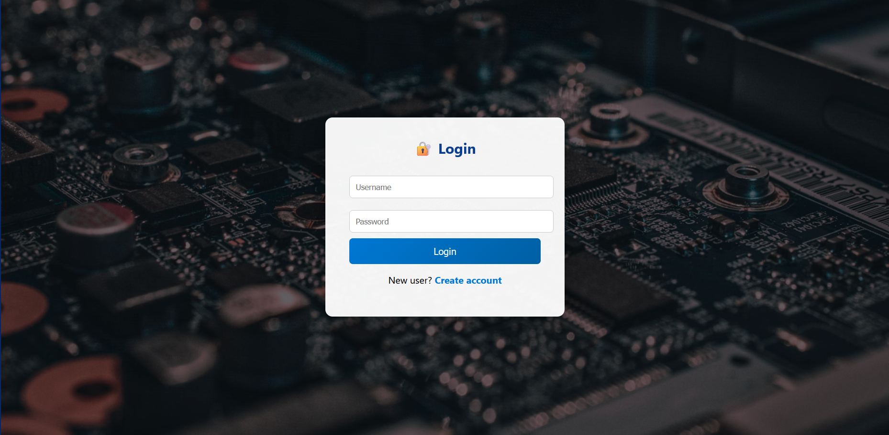
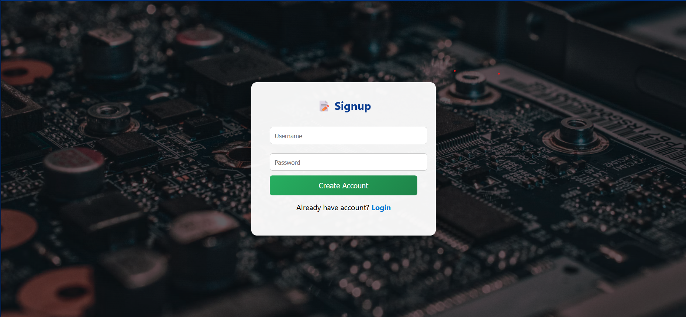
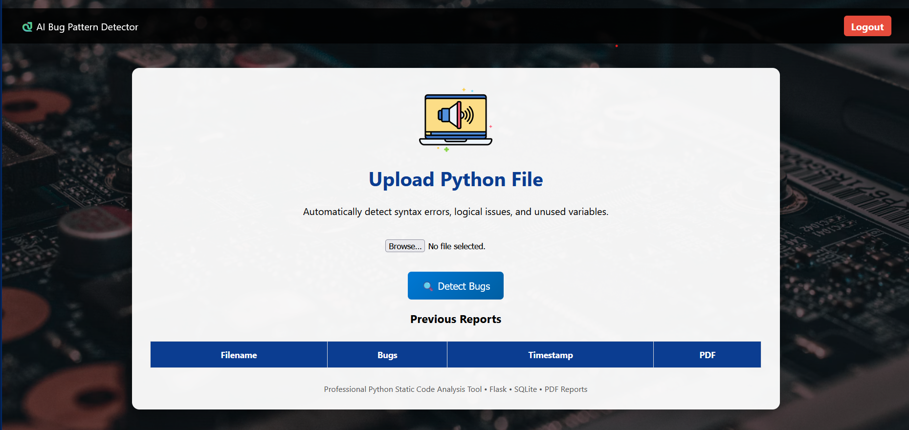
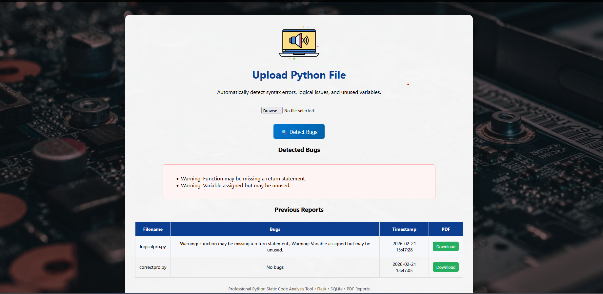

# 🐞 AI Bug Pattern Detector

An intelligent web-based application that detects and analyzes bug patterns using machine learning and provides insights through a clean dashboard interface.

---

## 🚀 Overview

AI Bug Pattern Detector is designed to help developers and testers quickly identify bug patterns and visualize results efficiently.
The system combines a Flask backend with machine learning logic to process inputs and display meaningful bug detection outcomes.

This project demonstrates practical skills in:

* Python backend development
* Machine learning integration
* Web application development
* Database handling
* Clean project structuring

---

## ✨ Features

* 🔐 User authentication (Login & Signup)
* 📊 Interactive system dashboard
* 🤖 AI-powered bug detection
* 🗄️ Database integration
* 🖥️ Clean web interface using templates
* 📸 Visual result display

---

## 🧠 Tech Stack

**Backend**

* Python
* Flask

**Machine Learning**

* scikit-learn
* NumPy
* Pandas

**Frontend**

* HTML
* CSS
* Jinja2 Templates

**Database**

* SQLite (via database.py)

---

## 📁 Project Structure

```
AI-Bug-Pattern-Detector/
│
├── app.py
├── database.py
├── requirements.txt
├── README.md
│
├── detector/
├── templates/
├── Screenshots/
```

---

## ⚙️ Installation & Setup

Follow these steps to run the project locally.

### 1️⃣ Clone the repository

```bash
git clone https://github.com/GautamiKamble3/AI-Bug-Pattern-Detector.git
cd AI-Bug-Pattern-Detector
```

---

### 2️⃣ Create virtual environment (recommended)

```bash
python -m venv venv
venv\Scripts\activate
```

---

### 3️⃣ Install dependencies

```bash
pip install -r requirements.txt
```

---

### 4️⃣ Run the application

```bash
python app.py
```

Open your browser and go to:

```
http://127.0.0.1:5000
```

---

## 📸 Screenshots

### 🔐 Login



### 📝 Signup



### 📊 System Dashboard



### 🤖 Bug Detection Result



---

## 🎯 Future Improvements

* ✅ Deploy to cloud (Render/Azure)
* ✅ Add real-time bug analytics
* ✅ Improve UI/UX
* ✅ Add API endpoints
* ✅ Enhance ML model accuracy

---

## 👩‍💻 Author

**Gautami Kamble**

* GitHub: https://github.com/GautamiKamble3

---

## ⭐ If you found this project useful

Give it a ⭐ on GitHub — it helps the project grow!
